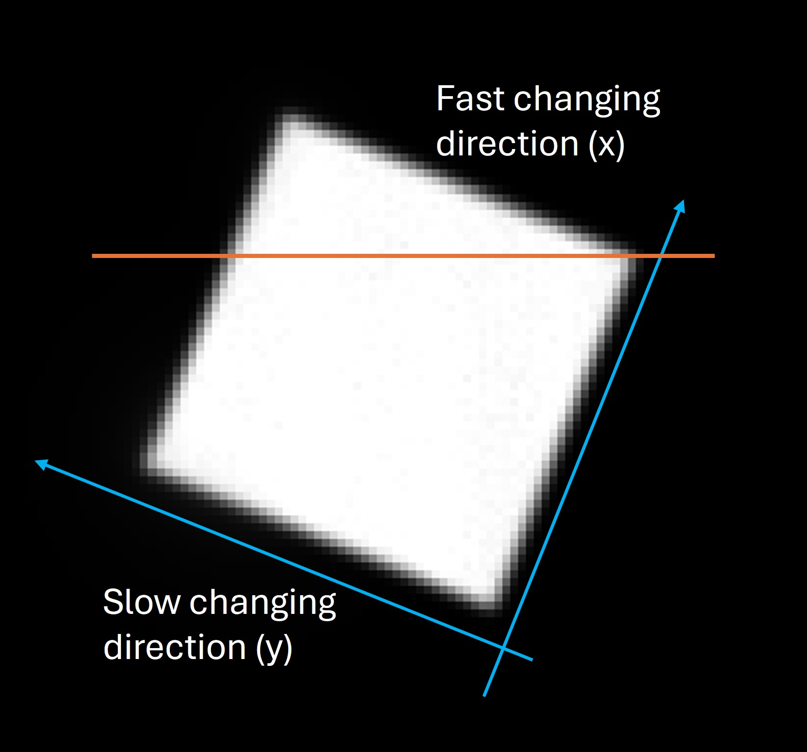
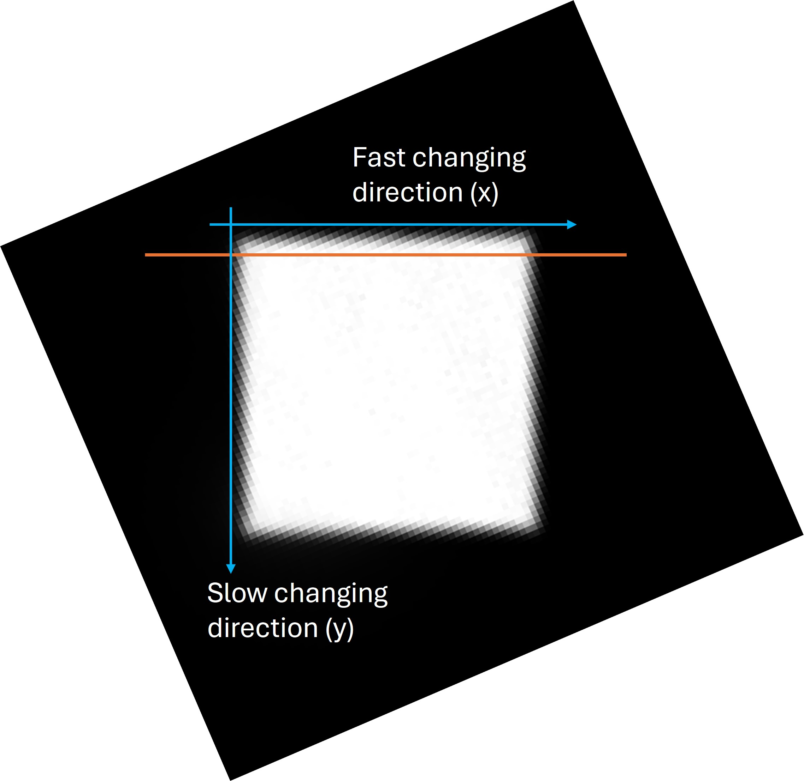
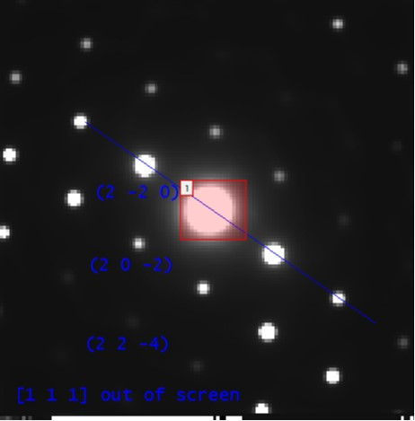

# Understand How to Define/Index LARBED Dataset

## Step 1: Experimental Pattern

### Step 1-1: Align LARBED Pattern and Single Diffraction Pattern

Unfortunately, the tilt scan direction is not aligned with either the x or y direction of the diffraction pattern. Therefore, we need to calibrate the tilt scan direction. To do this, a reference dataset is required—one with no sample, with the descan turned off, and acquired in reciprocal space. Only the transmission beam should be visible, and it should scan over reciprocal space.

In the figure below, the sum of the calibration dataset is shown. The white square represents the footprint of the transmission beam. To fit it into our usual diffraction orientation, the x-axis must be flipped and the image rotated roughly 112° clockwise. The result is shown in the second figure. After the rotation, the LARBED pattern will have the same orientation as the collected diffraction pattern.

  
  

### Step 1-2: Index Single Diffraction Pattern

Assume that we already have a good idea of the zone axis. There are two things that can be defined arbitrarily:
1. The out-of-plane zone axis direction.
2. The index of one diffraction spot, which is usually parallel to our x-axis direction.

For example, in the following figure, we know the zone axis is (or is close to) <111>, and we set [111] as the out-of-screen (or out-of-paper) direction. We also know that the closest diffraction spot is {220}, and we designate the spot to the left of the transmission beam as $(2\overline{2}0)$.

Next, we can determine the in-plane direction that is perpendicular to the x-axis direction by computing the cross product:

$(111) \times (2\overline{2}0) = (22\overline{4})$

When extracting the LARBED pattern from the diffraction patterns, the indices must be set correctly.

By setting these indices, we also define the direction of $K_t$ (i.e., the tilt of the center of the (000) disk). In this case, the tilt is directed from the zone axis to the transmission beam, approximately toward $(\overline{2}\overline{2}4)$.

### Step 1-3: Calibrate the Step Size of the Tilt Scan

To calibrate the step size of the tilt scan, two pieces of information are needed:
1. A reference dataset, with no sample, descan turned off, and acquired in reciprocal space (the same dataset used for orientation calibration).
2. A calibration of the detector at the camera length used for collecting the reference dataset. If the detector is not calibrated, a diffraction pattern of a known sample can be used to perform the calibration.

From the reference dataset, you can calculate how many pixels per step the beam moved in reciprocal space. From the detector calibration, you can convert pixels to reciprocal units (e.g., 1/nm). Next, the length of the x-axis is determined (using Bragg's law to convert d-spacing to 1/nm, or by measuring the distance between two diffraction spots in the dataset). Finally, dividing the length of the x-axis by the number of pixels per step gives the number of steps per x-axis length. This is the parameter that must be set in the pyEXTAL software.

## Step 2: Bloch Simulation

### Step 2-1: Orientation of Bloch Simulation

Bloch simulation requires three pieces of orientation-related information:

1. The zone axis direction.
2. The x-axis direction.
3. The tilt of the center of the (000) disk.

- The zone axis direction should be the same as the one defined in Step 1-2.
- The x-axis direction should also be the same as defined in Step 1-2 for the first g-vector.
- The tilt direction is determined in Step 1-2.

To align the Bloch simulation with the experimental results, an additional rotation should be applied. In the previous example, a counterclockwise rotation of 214° is required so that $(2\overline{2}0)$ points to the right and is parallel to the x-axis.
