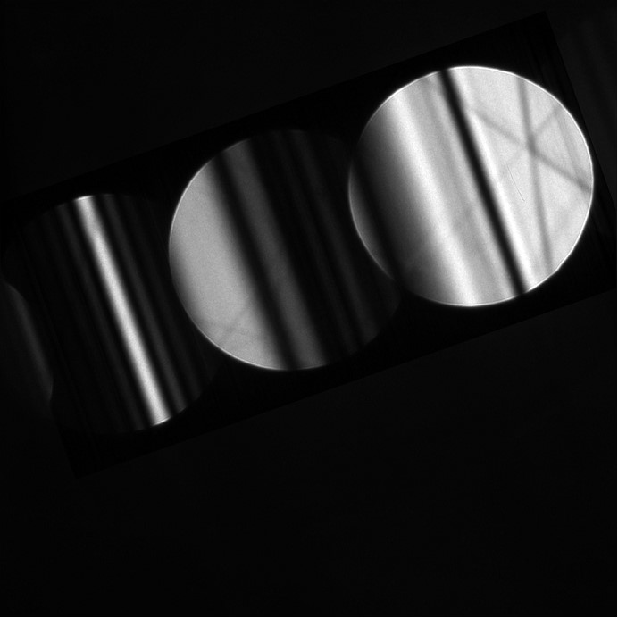
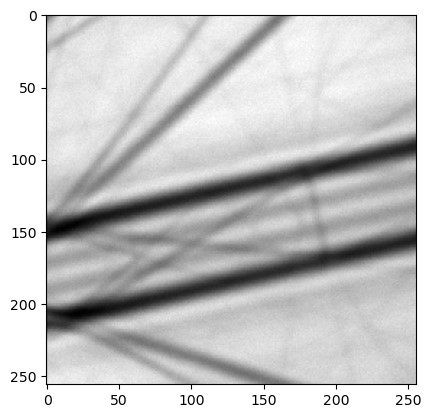
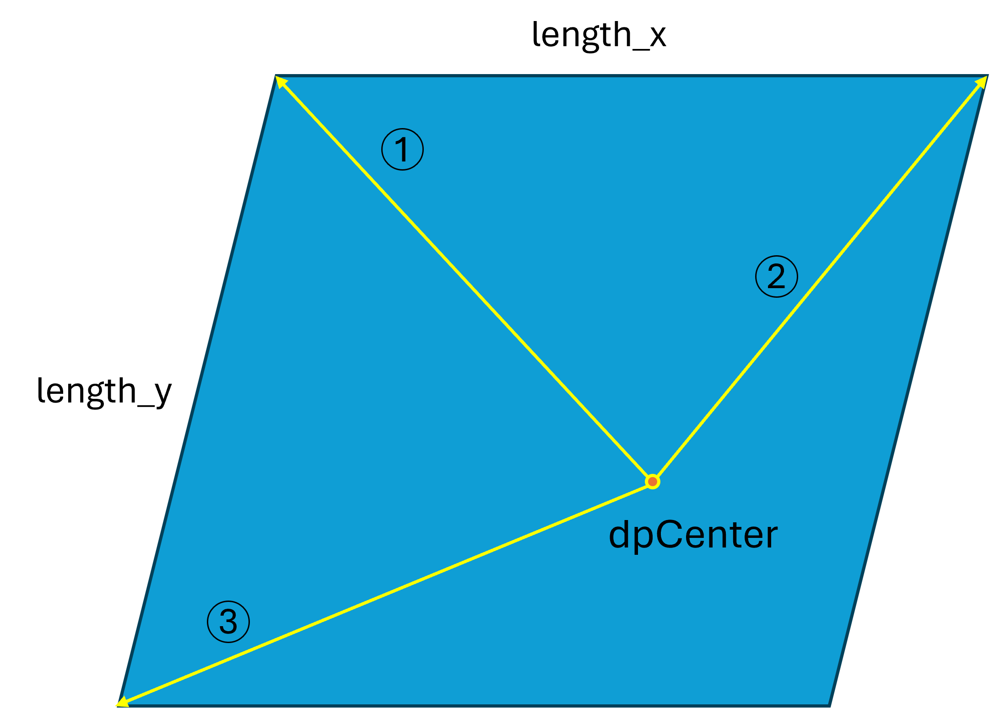

# Overview of ROI definition in pyextal

To correctly connect the experimental pattern and the simulation pattern, a specific transformation must be established between them. In pyextal , an additional intermediate state—referred to as **display**—is introduced between the experimental pattern and the simulation pattern.

## Experimental Pattern

### CBED Pattern  

### LARBED Pattern  

As shown, CBED and LARBED patterns have very different structures. CBED patterns typically appear as a single image covering multiple disks, whereas LARBED patterns usually consist of multiple images, with each image representing one diffraction disk.

To sample these patterns properly, when the `dinfo` class is associated with a data set and assigned to an `roi` class during initialization, a corresponding interpolation function is created. For CBED patterns, only one function is created; for LARBED patterns, each diffraction disk is interpolated separately. In this context, the top-left corner is defined as the origin `[j, i]`, where **j** indicates the vertical direction (downward) and **i** indicates the horizontal direction (to the right) (row-major order).

## Display

Display coordinates represent the space in which diffraction patterns are rotated based on the user's rotation parameter. The rotation aligns the designated x-axis horizontally, pointing to the right. Most operations are performed in this coordinate system, and the region of interest (ROI) is defined here.

For **CBED**, two parameters must be defined:

- **dpSize**: The size of the working space, specified as `[height_of_dp, width_of_dp]`. It should be large enough to contain all the disks of interest while excluding any excessive blank regions.
- **dpCenter**: The reference point corresponding to the center of the (000) disk. This is specified as `[j, i]` (with **j** for the vertical direction and **i** for the horizontal direction, using the top-left corner as the origin). This point is important for connecting to the simulation pattern.

For **LARBED**, these parameters do not need to be set manually. The `dpCenter` is automatically set to the top-left corner of the pattern, and `dpSize` is simply the size of the pattern.

Once these two parameters are defined, you are ready to select the ROI. Using the function `roi.selectROI`, you need to provide three vectors and two lengths (as illustrated in the following figure). Since the ROI is a parallelogram, three points are required to define it. All vectors are specified in the `[j, i]` system, relative to `dpCenter`. The parameters `length_x` and `length_y` define the number of points to sample within the ROI for **fine refinement** (coarse refinement is not affected by this setting).

### How to Select ROI  

## Simulation Pattern

The simulation pattern shares the same orientation as the display coordinate system. However, it is defined in the \(K_t\) coordinate system, where each pixel corresponds to the tangential tilt vector relative to the zone axis. Note that this coordinate system is no longer represented as `[j, i]`; instead, it is a right-handed system following the relation:

$$zone \times x = y$$  

Therefore, when transforming between display and simulation coordinates, an inversion of the sign for the vertical direction is required.

---

## Setting tilt0

tilt0 refers to the indicdent beam direction of set in .dat file. In some cases, the tilt of the incident beam can be determined accurately without using coarse refinement (for example, by using the intersection of the HOLZ line). In such instances, you may want to assign a specific tilt to a pixel in the experimental pattern. This can be achieved by using the function `roi.setTilt0`, which accepts $K_t$ and the pixel coordinates as parameters.

Additionally, you can look up where a certain $K_t$ value corresponds in display space (relative to `dpCenter`) using `roi.kt2pixel`. To convert from display to experimental coordinates, use `roi.pixel2exp`.

---

## How Everything Is Connected

After selecting the ROI, a grid in display space (relative to `dpCenter`) is generated based on the input parameters. This grid is then transformed and propagated to both the experimental and simulation coordinate systems.

## Transformation Between each coordinates
### From Display to Experiment (`roi.updateExpGrid`)
1. **Conversion of Origin:** The grid is first converted back to a coordinate system with the origin at the top left corner (this step is skipped for LARBED).
2. **Rotation to Experimental Space:** The grid is rotated back into the experimental space using `roi.transformDP`. This function not only rotates the grid but also applies a shift (via `roi.shift`) to align the experimental pattern with `dpCenter`.
3. **Propagation to Other Disks:** The grid is then propagated to the other disks based on rotation and a geometric transformation. (For LARBED, this step is skipped; instead, different interpolation functions are sampled for each disk at the same position.)

### From Experiment to Display
1. Use `roi.inverse` to convert experimental coordinates to display coordinates, assuming the origin is at the top left corner.  
   **Note:** The code was modified from `skimage.transform.rotate`, which uses the `[x, y]` coordinate order. Therefore, all coordinates need to be flipped accordingly.
2. Calculate the offset from `dpCenter`.

### From Display to Simulation (`roi.updateSimGrid`)
1. **Calculate \(K_t\) Vectors:** Compute the \(K_t\) vectors for the x and y directions.
2. **Apply Grid Multiplication:** Since the grid is defined relative to `dpCenter`, multiply it by the corresponding xtilt and ytilt vectors.  
   **Note:** Be sure to account for the sign inversion.
3. **Add tilt0:** Add `tilt0` (the tilt corresponding to `dpCenter`).

### From Simulation to Display (`roi.kt2pixel`)
1. **Subtract tilt0:** Subtract `tilt0` from the \(K_t\) vector of interest to make it relative to `dpCenter`.
2. **Calculate \(K_t\) Vectors:** Compute the \(K_t\) vectors for the x and y directions.
3. **Decompose the Vectors:** Decompose the result into the number of xtilt and ytilt units.  
   **Note:** Watch out for sign inversion; the returned value is `[-offset_y, offset_x]`.

The corresponding equations are:

$$offset_x = \frac{(K_t - tilt_0) \cdot xtilt}{|xtilt|^2}$$

$$offset_y = \frac{(K_t - tilt_0) \cdot ytilt}{|ytilt|^2}$$

